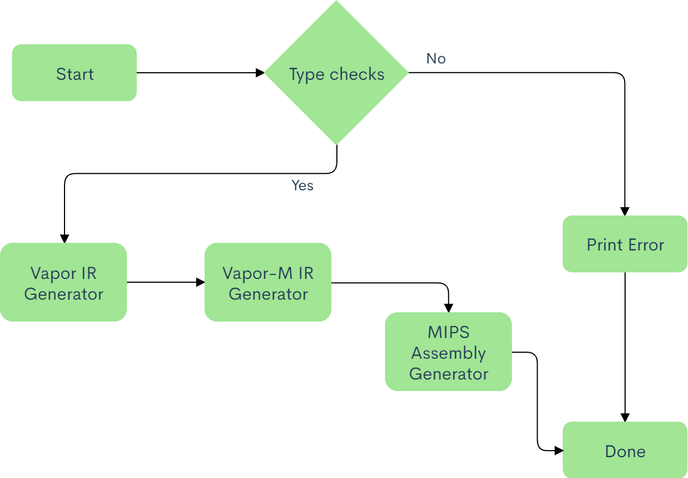

# MiniJAVA Compiler
This is a miniJAVA compiler for the MIPS platform. This compiler uses the vapor programming language as an
intermediate representation and does incremental lowering to vapor-M and finally to MIPS assembly. This compiler only
supports printing of integer values to screen, printing of strings are not supported. 

## MiniJAVA Grammar and TypeSystem
The Backus–Naur form of the minijava programming language can be found 
[here](http://www.cambridge.org/resources/052182060X/MCIIJ2e/grammar.htm). Documentation relating to the  MiniJava
type system can be found 
[here](https://cs.colostate.edu/~pouchet/classes/CS453SP20/hw25-minijava/cs453/doc/miniJava-typesystem.pdf).

## Project Layout
This project is separated into five modules, where each module does incremental lowering of the original miniJava
program. The reason this is done is because it is very difficult and more error prone to directly translate an object
-oriented programming language such as miniJava with high level constructs such as function overriding and
inheritance into assembly. As a result we use the strategy of incremental lowering though the use of the visitor
design pattern to translate a miniJava program into assembly. The flowchart for the project layout is slown below:



The typechecking system is responsible for making sure that all types in the user input minJava program is valid, and
that the compiler during later steps of code generation does not do invalid implicit type conversion. This system is
also responsible for checking for circular inheritance. All of this is done through the use of a hierarchical
scoped symbol table and the visitor design pattern. If this system encounters a program that fails to typecheck, a
 `Type error` message is printed to stdout, else the control is passed to the Vapor IR code generation system.

The Vapor IR code generation system is responsible for translating a valid miniJava program that typechecks into its
equivalent Vapor intermediate representation. The Vapor IR code generation system is responsible for doing one way
implicit type casting and function overriding. To accomplish the generation of Vapor IR code, this system also uses a
symbol table that is different from the symbol table in the Typechecking system. The difference in the symbol table
is in the binding information of the symbols. The binding information of symbols in this symbol table contains three
fields: type name, offset, and scope as opposed to two fields in the Typechecking system. This module is also
responsible for creating the memory layout of the user input miniJava program. Advantages of incremental lowering to
Vapor IR is that it is closer to assembly, but still does not fully impose the constraints of writing code in
assembly. The constraints of writing code in assembly include limited number of registers, having to setup the
function call stack manually, and writing additional code to retrieve return values from functions. 

The Vapor-M IR code generation system is responsible for generating the Vapor-M translation of the code generated
from the Vapor IR code generation system. Vapor-M code is closer to MIPS assembly than Vapor. As a result, all of the
limitations of assembly is imposed on code written in Vapor-M. To deal with the issue of limited number of registers
we use the linear scan register allocation algorithm for optimal register allocation. The MIPS assembly has a set of
23 registers, these are `$a0, …, $a3`, `$s0, …, $s7`, `$t0, …, $t8`, and `$v0, $v1`. The `$a` registers are for
argument passing during function calls. If a function takes in more than four arguments, the `in/out` space in the
stack is used. For convenience in storing temporary result of calculations, we have a set of three reserved registers
: `$s6, $s7, $v1`. To get the return value of a function we use `$v0` register. All other registers are used in the
optimal register allocation algorithm. The function call stack is generated after analyzing the parameter list of
the function to be called. For instance if a function takes more than four arguments, then additional stack frames
are allocated for passing additional arguments. If the return from a function is void, then there is no additional code
generated to read or clean the return register: `$v0`. The signature to declare a function in Vapor-M is: ` func Main
[in 0, out 0, local 17]`. Here, `in` and `out` represents the number of in and out stack frames. If a function
wants to call another function with more than four arguments, then the additional argument values are written to the
out stack of the caller function and when control goes to the callee function, these additional arguments are read
from the `in` stack. The `local` represents the number of variables in the current function whose value resides in
the function local stack. These are generally values for variables that have been spilled by the register allocation
algorithm.

The MIPS assembly code generator is the final phase in the miniJava compiler. This is responsible for taking in the
code generated from the Vapor-M IR code generation system, and translating it into MIPS assembly to be run on the
MIPS emulator. Unlike the vapor intermediate representations, the MIPS assembly has no built-in functions such as
`PrintIntS()`, `Error()`, and `HeapAllocZ()`. Implementations for these built-ins are inserted in the epilogue
section of the final MIPS code. In MIPS assembly we also have to generate the function call stack manually. This
is done through the function prologue and epilogue before the call to the function.

## TypeChecking
In this section we describe the Typechecking system in depth, including the data structures and the layout of the
symbol table.

### Symbol Table
The symbol table is the core component of the Typechecking system.

In this homework assignment we build a type check system for the miniJAVA programming language. The input to this
program is a valid miniJAVA program that parses but does not necessarily type check. The output of this program is
either "Program type checked successfully" or "Type error". If there is a type error such as assigning an integer to
a boolean the program will output "Type error", else the program will output "Program type checked successfully
". This assignment also deals with checking for implicit type casting. For instance if we have two classes: class A
and C, and A extends C, then the following program should type check:
```
class Main {
  public static void main(String[] args) {
    A a ;
    C c;
    int v;
    a = new A();
    c = new C();
    c = a;   // a has been implicitly type casted to C
    v = a.init((new A())); // a will be implicitly type casted to C
    System.out.println(v); //10
    v = a.init(new C());
    System.out.println(v); //10
  }
}

class A extends C {
    public int init(C c) {
        return 10;
    }
}

class C {
    public int init(int a) {
        return 12;
    }
}
```
In addition to checking for implicit typecasts, the program also checks for circular inheritance. If a circular
inheritance is detected, the program prints "Type error".

## Vapor IR
For this assignment, we built a vapor translator for the miniJAVA programming language. The vapor programming language is one level closer to the MIPS assembly than miniJAVA. In the vapor programming language, the stack is managed by the vapor interpreter. Also, in this programming language there is an infinite number of registers. This program visits every node in the miniJAVA Abstract Syntax Tree (AST), and translates it to its vapor representation. 

## Vapor-M IR
The porpose of this assignment is to translate a vapor program into a vapor-M program. The vapor-M program is closer to the MIPS assembly than the respective vapor program. It is closer in the sense that the translator has to insert vapor-M code to manage the memory layout of the stack. The vapor-M program also has a limited number of registers. There are four registers for argument passing: `$a0, ..., $a3`. If a function takes more than 4 arguments, then the `in/out` stack is used to pass the additional arguments after the four argument registers have been used. In addition to the argument registers, there is also callee saved and caller saved and reserved registers and return value registers. The callee saved registers are: `$s0, .., $s5`. The caller sved registers are: `$t0, ..., $t8`. The return registers are `$v0`. The set of reserved registers are: `$s6, $s7, $v1`. The value of callee saved registers are preserved accross calls, while the value of caller saved registers is not guaranteed to be preserved across calls. Callee saved registers are preserved across calls using the following algorithm: 
  * Before the `call` statement, backup all the callee saved registers in the function local stack
  * After the `call` statement restore all backed up callee saved register.

For the purpose of correctness, I am also backing up the argument registers and restoring their values after the `call` statement. Since there is a limited number of registers, this programming assignment also uses the Linear Scan Register Allocation algorithm to make register allocations, i.e. deciding which variables are assigned to which register or the stack. One of the problems with this algorithm is that it does not take holes in live intervals into account. If a variable gets spilled on the stack it stays spilled till the end of the function.
In order to compute the live interval, this assignment uses control flow graph for a function. A control flow graph (CFG) captures all possible execution paths for a program, in our case it will capture all possible execution paths in the function. The CFG in this assignment used a basic block size of 1, i.e. each node in the CFG only contained one vapor statement. After the control flow graph is built, the use-def sets for each basic block is populated. This set contains the variables that are used and the variables that are defined in a basic block. Once the use-def sets for all basic blocks is computed, the live-in and live-out sets are computed using the following algorithm.

Once the live-in and live-out sets are computed. the live range for a variable are all the basic blocks where the variable is both live-in and live-out.

## MIPS Assembly
This is the last translation phase in the miniJAVA compiler. This translation phase takes in a vapor-M program and translates it into MIPS assembly using the vapor-M visitor to visit every node in the vapor-M abstract syntax tree and generate MIPS assembly code for that node. Here, the compiler must generate code that takes of stack frame allocations and deallocations during function calls. The compiler must also generate code for vapor and vapor-M builtins such as `HeapAllocZ` and `PrintIntS()`.

## Usage Example
This project requires that gradle be installed. Before you can run the project, you need to install it. This is done
by running the `make install` command. Once this command is issued, you will see a `install` directory. The
`MiniJavaCompiler` executable is located in this directory. To compile, for instance, the following program:
```java
class Main {
    public static void main(String[] a){
      System.out.println(12 + 21);
    }
}
```
which is saved as `add.java` navigate to the install directory and issue: `./MiniJavaCompiler --file add.java --o add
.s`. This will generate a file with the `.s` extension containing the MIPS assembly code of `add.java`. To get
 verbose details on the assembly code generation process use the additional `--verbose` flag. The generated assembly
  code for the above program is laid out below:
```mips
.data
 
 .text
 
   jal Main
   li $v0 10
   syscall
 
 Main:
   sw $fp -8($sp)
   move $fp $sp
   subu $sp $sp 76
   sw $ra -4($fp)
   li $t0 33 #2
   move $a0 $t0
   jal _print
   lw $ra -4($fp)
   lw $fp -8($fp)
   addu $sp $sp 76
   jr $ra
 
 AllocArray:
   sw $fp -8($sp)
   move $fp $sp
   subu $sp $sp 76
   sw $ra -4($fp)
   move $t1 $a0
   mul $t0 $t1 4
   addu $t0 $t0 4
   move $a0 $t0
   jal _heapAlloc
   move $t2 $v0
   sw $t1 0($t2)
   move $v0 $t2
   lw $ra -4($fp)
   lw $fp -8($fp)
   addu $sp $sp 76
   jr $ra
 
 _print:
   li $v0 1   # syscall: print integer
   syscall
   la $a0 _newline
   li $v0 4   # syscall: print string
   syscall
   jr $ra
 
 _error:
   li $v0 4   # syscall: print string
   syscall
   li $v0 10  # syscall: exit
   syscall
 
 _heapAlloc:
   li $v0 9   # syscall: sbrk
   syscall
   jr $ra
 
 .data
 .align 0
 _newline: .asciiz "\n"
 _str0: .asciiz "null pointer\n"
 _str1: .asciiz "array index out of bounds\n"  
```

## Running the generated MIPS code
This project also comes with a run script that is located in the root directory of the project. This allows you to run
your generated MIPS assembly code on the MARS MIPS emulator. To run the above generated `add.s` MIPS assembly code
use the following command from the project root:
```shell script
./run ./install/add.s
```
This will generate a value of `33` on the terminal.

## In-code citation
All external resources used during the project are cited within the code.

## License
MIT License

Copyright (c) 2020 RoySRC

Permission is hereby granted, free of charge, to any person obtaining a copy
of this software and associated documentation files (the "Software"), to deal
in the Software without restriction, including without limitation the rights
to use, copy, modify, merge, publish, distribute, sublicense, and/or sell
copies of the Software, and to permit persons to whom the Software is
furnished to do so, subject to the following conditions:

The above copyright notice and this permission notice shall be included in all
copies or substantial portions of the Software.

THE SOFTWARE IS PROVIDED "AS IS", WITHOUT WARRANTY OF ANY KIND, EXPRESS OR
IMPLIED, INCLUDING BUT NOT LIMITED TO THE WARRANTIES OF MERCHANTABILITY,
FITNESS FOR A PARTICULAR PURPOSE AND NONINFRINGEMENT. IN NO EVENT SHALL THE
AUTHORS OR COPYRIGHT HOLDERS BE LIABLE FOR ANY CLAIM, DAMAGES OR OTHER
LIABILITY, WHETHER IN AN ACTION OF CONTRACT, TORT OR OTHERWISE, ARISING FROM,
OUT OF OR IN CONNECTION WITH THE SOFTWARE OR THE USE OR OTHER DEALINGS IN THE
SOFTWARE.
