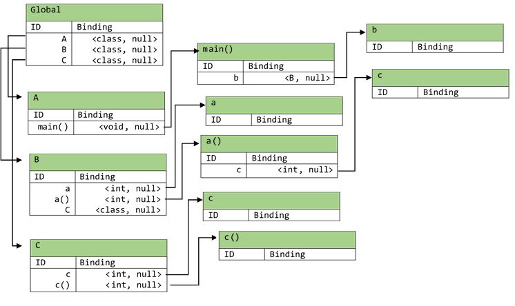
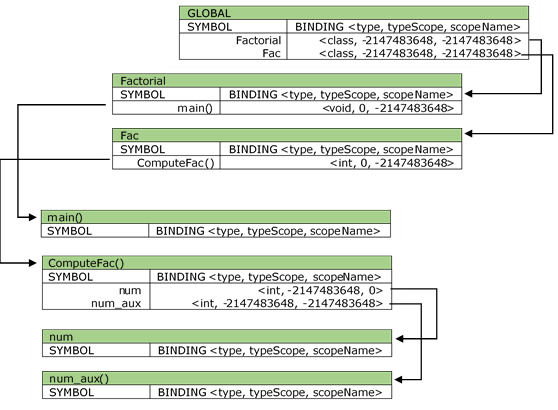
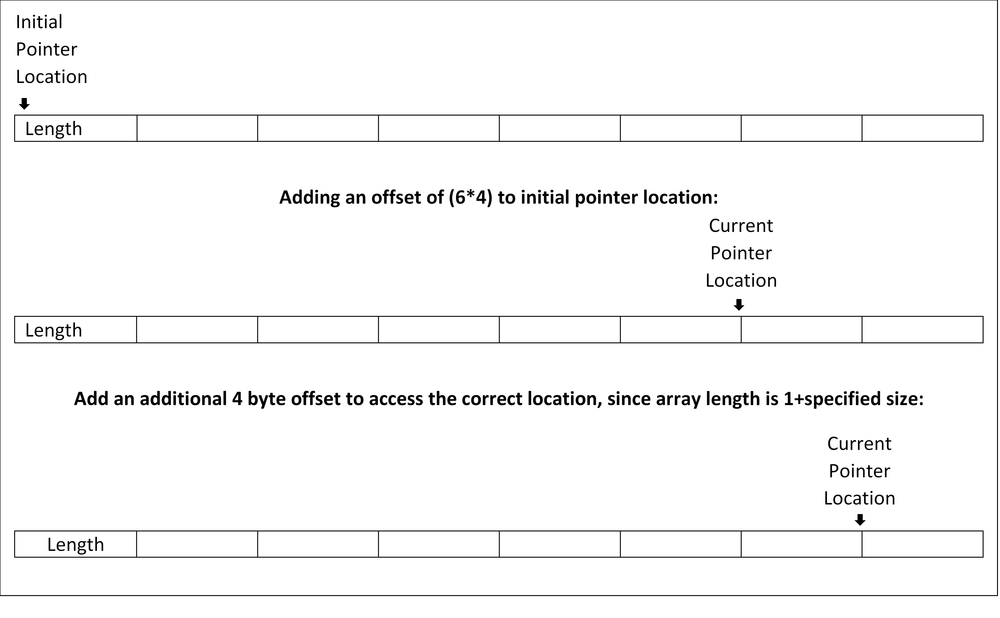

# MiniJAVA Compiler
This is a miniJAVA compiler for the MIPS platform. This compiler uses the vapor programming language as an
intermediate representation and does incremental lowering to vapor-M and finally to MIPS assembly. This compiler only
supports printing of integer values to screen, printing of strings are not supported. 

## MiniJAVA Grammar and TypeSystem
The Backus–Naur form of the minijava programming language can be found 
[here](http://www.cambridge.org/resources/052182060X/MCIIJ2e/grammar.htm). Documentation relating to the  MiniJava
type system can be found 
[here](https://cs.colostate.edu/~pouchet/classes/CS453SP20/hw25-minijava/cs453/doc/miniJava-typesystem.pdf).

## Project Layout
This project is separated into five modules, where each module does incremental lowering of the original miniJava
program. The reason this is done is because it is very difficult and more error prone to directly translate an object
-oriented programming language such as miniJava with high level constructs such as function overriding and
inheritance into assembly. As a result we use the strategy of incremental lowering though the use of the visitor
design pattern to translate a miniJava program into assembly. The flowchart for the project layout is slown below:


The typechecking system is responsible for making sure that all types in the user input minJava program is valid, and
that the compiler during later steps of code generation does not do invalid implicit type conversion. This system is
also responsible for checking for circular inheritance. All of this is done through the use of a hierarchical
scoped symbol table and the visitor design pattern. If this system encounters a program that fails to typecheck, a
 `Type error` message is printed to stdout, else the control is passed to the Vapor IR code generation system.

The Vapor IR code generation system is responsible for translating a valid miniJava program that typechecks into its
equivalent Vapor intermediate representation. The Vapor IR code generation system is responsible for doing one way
implicit type casting and function overriding. To accomplish the generation of Vapor IR code, this system also uses a
symbol table that is different from the symbol table in the Typechecking system. The difference in the symbol table
is in the binding information of the symbols. The binding information of symbols in this symbol table contains three
fields: type name, offset, and scope as opposed to two fields in the Typechecking system. This module is also
responsible for creating the memory layout of the user input miniJava program. Advantages of incremental lowering to
Vapor IR is that it is closer to assembly, but still does not fully impose the constraints of writing code in
assembly. The constraints of writing code in assembly include limited number of registers, having to setup the
function call stack manually, and writing additional code to retrieve return values from functions. 

The Vapor-M IR code generation system is responsible for generating the Vapor-M translation of the code generated
from the Vapor IR code generation system. Vapor-M code is closer to MIPS assembly than Vapor. As a result, all of the
limitations of assembly is imposed on code written in Vapor-M. To deal with the issue of limited number of registers
we use the linear scan register allocation algorithm for optimal register allocation. The MIPS assembly has a set of
23 registers, these are `$a0, ..., $a3`, `$s0, ..., $s7`, `$t0, ..., $t8`, and `$v0, $v1`. The `$a` registers are for
argument passing during function calls. If a function takes in more than four arguments, the `in/out` space in the
stack is used. For convenience in storing temporary result of calculations, we have a set of three reserved registers
: `$s6, $s7, $v1`. To get the return value of a function we use `$v0` register. All other registers are used in the
optimal register allocation algorithm. The function call stack is generated after analyzing the parameter list of
the function to be called. For instance if a function takes more than four arguments, then additional stack frames
are allocated for passing additional arguments. If the return from a function is void, then there is no additional code
generated to read or clean the return register: `$v0`. The signature to declare a function in Vapor-M is: ` func Main
[in 0, out 0, local 17]`. Here, `in` and `out` represents the number of in and out stack frames. If a function
wants to call another function with more than four arguments, then the additional argument values are written to the
out stack of the caller function and when control goes to the callee function, these additional arguments are read
from the `in` stack. The `local` represents the number of variables in the current function whose value resides in
the function local stack. These are generally values for variables that have been spilled by the register allocation
algorithm.

The MIPS assembly code generator is the final phase in the miniJava compiler. This is responsible for taking in the
code generated from the Vapor-M IR code generation system, and translating it into MIPS assembly to be run on the
MIPS emulator. Unlike the vapor intermediate representations, the MIPS assembly has no built-in functions such as
`PrintIntS()`, `Error()`, and `HeapAllocZ()`. Implementations for these built-ins are inserted in the epilogue
section of the final MIPS code. In MIPS assembly we also have to generate the function call stack manually. This
is done through the function prologue and epilogue before the call to the function.

## Helper Packages
In order to help us with type checking and translating the high level object-oriented miniJava program into Vapor IR
code, we have decided to write a series of helper packages for visualization of the control flow in the abstract
syntax tree (AST) nodes. We only need to write the visualizer for the initial type checking system and the conversion
to Vapor IR. Both of these systems take in as input a miniJava program. Vapor IR and Vapor-M IR code does not have as
complex of an AST structure as the equivalent miniJava program. We call this miniJava AST visualizer, the Pretty
Print Visitor. The stdout of this package is best illustrated through the following code block and its visualized AST.
```java
class Factorial{
    public static void main(String[] a){
        System.out.println(new Fac().ComputeFac(10));
    }
}

class Fac {
    public int ComputeFac(int num){
        int num_aux ;
        if (num < 1)
            num_aux = 1 ;
        else
            num_aux = num * (this.ComputeFac(num-1)) ;
        return num_aux ;
    }
}
```
The AST visualization of the above code block is illustrated below:
```
Goal
├─ MainClass
│   ├─ NodeToken →  "class"
│   ├─ Identifier
│   │   └─ NodeToken →  "Factorial"
│   ├─ NodeToken →  "{"
│   ├─ NodeToken →  "public"
│   ├─ NodeToken →  "static"
│   ├─ NodeToken →  "void"
│   ├─ NodeToken →  "main"
│   ├─ NodeToken →  "("
│   ├─ NodeToken →  "String"
│   ├─ NodeToken →  "["
│   ├─ NodeToken →  "]"
│   ├─ Identifier
│   │   └─ NodeToken →  "a"
│   ├─ NodeToken →  ")"
│   ├─ NodeToken →  "{"
│   ├─ NodeListOptional
│   ├─ NodeListOptional
│   │   └─ Statement
│   │       └─ PrintStatement
│   │           ├─ NodeToken →  "System.out.println"
│   │           ├─ NodeToken →  "("
│   │           ├─ Expression
│   │           │   └─ MessageSend
│   │           │       ├─ PrimaryExpression
│   │           │       │   └─ AllocationExpression
│   │           │       │       ├─ NodeToken →  "new"
│   │           │       │       ├─ Identifier
│   │           │       │       │   └─ NodeToken →  "Fac"
│   │           │       │       ├─ NodeToken →  "("
│   │           │       │       └─ NodeToken →  ")"
│   │           │       ├─ NodeToken →  "."
│   │           │       ├─ Identifier
│   │           │       │   └─ NodeToken →  "ComputeFac"
│   │           │       ├─ NodeToken →  "("
│   │           │       ├─ NodeOptional
│   │           │       │   └─ ExpressionList
│   │           │       │       ├─ Expression
│   │           │       │       │   └─ PrimaryExpression
│   │           │       │       │       └─ IntegerLiteral
│   │           │       │       │           └─ NodeToken →  "10"
│   │           │       │       └─ NodeListOptional
│   │           │       └─ NodeToken →  ")"
│   │           ├─ NodeToken →  ")"
│   │           └─ NodeToken →  ";"
│   ├─ NodeToken →  "}"
│   └─ NodeToken →  "}"
├─ NodeListOptional
│   └─ TypeDeclaration
│       └─ ClassDeclaration
│           ├─ NodeToken →  "class"
│           ├─ Identifier
│           │   └─ NodeToken →  "Fac"
│           ├─ NodeToken →  "{"
│           ├─ NodeListOptional
│           ├─ NodeListOptional
│           │   └─ MethodDeclaration
│           │       ├─ NodeToken →  "public"
│           │       ├─ Type
│           │       │   └─ IntegerType
│           │       │       └─ NodeToken →  "int"
│           │       ├─ Identifier
│           │       │   └─ NodeToken →  "ComputeFac"
│           │       ├─ NodeToken →  "("
│           │       ├─ NodeOptional
│           │       │   └─ FormalParameterList
│           │       │       ├─ FormalParameter
│           │       │       │   ├─ Type
│           │       │       │   │   └─ IntegerType
│           │       │       │   │       └─ NodeToken →  "int"
│           │       │       │   └─ Identifier
│           │       │       │       └─ NodeToken →  "num"
│           │       │       └─ NodeListOptional
│           │       ├─ NodeToken →  ")"
│           │       ├─ NodeToken →  "{"
│           │       ├─ NodeListOptional
│           │       │   └─ VarDeclaration
│           │       │       ├─ Type
│           │       │       │   └─ IntegerType
│           │       │       │       └─ NodeToken →  "int"
│           │       │       ├─ Identifier
│           │       │       │   └─ NodeToken →  "num_aux"
│           │       │       └─ NodeToken →  ";"
│           │       ├─ NodeListOptional
│           │       │   └─ Statement
│           │       │       └─ IfStatement
│           │       │           ├─ NodeToken →  "if"
│           │       │           ├─ NodeToken →  "("
│           │       │           ├─ Expression
│           │       │           │   └─ CompareExpression
│           │       │           │       ├─ PrimaryExpression
│           │       │           │       │   └─ Identifier
│           │       │           │       │       └─ NodeToken →  "num"
│           │       │           │       ├─ NodeToken →  "<"
│           │       │           │       └─ PrimaryExpression
│           │       │           │           └─ IntegerLiteral
│           │       │           │               └─ NodeToken →  "1"
│           │       │           ├─ NodeToken →  ")"
│           │       │           ├─ Statement
│           │       │           │   └─ AssignmentStatement
│           │       │           │       ├─ Identifier
│           │       │           │       │   └─ NodeToken →  "num_aux"
│           │       │           │       ├─ NodeToken →  "="
│           │       │           │       ├─ Expression
│           │       │           │       │   └─ PrimaryExpression
│           │       │           │       │       └─ IntegerLiteral
│           │       │           │       │           └─ NodeToken →  "1"
│           │       │           │       └─ NodeToken →  ";"
│           │       │           ├─ NodeToken →  "else"
│           │       │           └─ Statement
│           │       │               └─ AssignmentStatement
│           │       │                   ├─ Identifier
│           │       │                   │   └─ NodeToken →  "num_aux"
│           │       │                   ├─ NodeToken →  "="
│           │       │                   ├─ Expression
│           │       │                   │   └─ TimesExpression
│           │       │                   │       ├─ PrimaryExpression
│           │       │                   │       │   └─ Identifier
│           │       │                   │       │       └─ NodeToken →  "num"
│           │       │                   │       ├─ NodeToken →  "*"
│           │       │                   │       └─ PrimaryExpression
│           │       │                   │           └─ BracketExpression
│           │       │                   │               ├─ NodeToken →  "("
│           │       │                   │               ├─ Expression
│           │       │                   │               │   └─ MessageSend
│           │       │                   │               │       ├─ PrimaryExpression
│           │       │                   │               │       │   └─ ThisExpression
│           │       │                   │               │       │       └─ NodeToken →  "this"
│           │       │                   │               │       ├─ NodeToken →  "."
│           │       │                   │               │       ├─ Identifier
│           │       │                   │               │       │   └─ NodeToken →  "ComputeFac"
│           │       │                   │               │       ├─ NodeToken →  "("
│           │       │                   │               │       ├─ NodeOptional
│           │       │                   │               │       │   └─ ExpressionList
│           │       │                   │               │       │       ├─ Expression
│           │       │                   │               │       │       │   └─ MinusExpression
│           │       │                   │               │       │       │       ├─ PrimaryExpression
│           │       │                   │               │       │       │       │   └─ Identifier
│           │       │                   │               │       │       │       │       └─ NodeToken →  "num"
│           │       │                   │               │       │       │       ├─ NodeToken →  "-"
│           │       │                   │               │       │       │       └─ PrimaryExpression
│           │       │                   │               │       │       │           └─ IntegerLiteral
│           │       │                   │               │       │       │               └─ NodeToken →  "1"
│           │       │                   │               │       │       └─ NodeListOptional
│           │       │                   │               │       └─ NodeToken →  ")"
│           │       │                   │               └─ NodeToken →  ")"
│           │       │                   └─ NodeToken →  ";"
│           │       ├─ NodeToken →  "return"
│           │       ├─ Expression
│           │       │   └─ PrimaryExpression
│           │       │       └─ Identifier
│           │       │           └─ NodeToken →  "num_aux"
│           │       ├─ NodeToken →  ";"
│           │       └─ NodeToken →  "}"
│           └─ NodeToken →  "}"
└─ NodeToken →  ""
```
From the above visualization it can be seen that `Goal` is the entry point into the AST nodes and also `Goal` is the
root of the AST. In this specific example, the `Goal` node has two child nodes – the root of the AST node for the
main class, and the root node of the AST of the `Fac` class. In general, there can be more than one class other than
the main class in a miniJava program. All of these classes will have their own AST, and the root nodes of these ASTs
will be the child of the `Goal` node.

## TypeChecking
In this section we describe the Typechecking system in depth, including the data structures and the layout of the
symbol table.

### Symbol Table Visitor
The symbol table is the core component of the type checking system. We are using a scoped hierarchical symbol table
data structure to efficiently capture information about functions in classes, variables in functions and inheritance
hierarchy. The hierarchical symbol table is a tree based data structure where the nodes are tables with two columns
. The first column contains the symbols, and the second column contains the binding information of the symbols. The
binding information stores information about the type of the symbol and whether the symbol is a parameter. If the
symbol is a function identifier, then the type in the binding information is the return type of the function.

To build the symbol table we perform three passes over the MiniJava program.  The first pass builds a preliminary
hierarchical symbol table tree data structure. In addition to building the tree based data structure, it also checks
for duplicate declaration of identifiers. If a duplicate declaration of an identifier is found, an error will be
thrown. We illustrate this first pass with the following code example:
```c++
class A {
  public static void main(String[] args) {
    B b;
    b = new B();
    System.out.println(b.a());
  }
}

class B extends C {
  int a;
  public int a() {
    int c;
    c = this.c();
    a = 12 * c;
    return a;
  }
}

class C {
  int c;

  public int c() {
    c = 12;
    return c;
  }
}
```
The symbol table for the above code block after the first pass is as follows:


As can be seen from the above generated symbol table that the global symbol table stores pointers to the symbol
tables of all classes. In this case there are three classes: `A`, `B`, and `C`. The binding information for these
three symbols in the global symbol table is `<class, null>`. This is because `A`, `B`, and `C` are classes. The
symbol tables for the three classes contains pointers to the symbol tables of member variables and functions. The
symbol tables for functions contains pointers to the symbol tables of the variables declared in the function scope
and the function parameter list. One thing that can be observed from the above generated symbol table is that there
is no link between the symbol `C` in the symbol table for B and the symbol table of class `C`. There should be a link
between these two because class `B` inherits from class `C`, and the link makes it possible to access all the member
variables and functions in class `C` from class `B`. This link is added in the second pass.

The second pass in the symbol table visitor is responsible for creating the inheritance links between nodes of the
hierarchical symbol table data structure. After the second pass, the above symbol table looks as follows:


This second pass uses a different symbol table visitor called the symbol table inheritance visitor. Notice the red
link. This link signifies that class `B` inherits from class `C`. During the second pass, an error is thrown if a
class inherits from a class that does not exist. 

After the second pass, there is one additional pass - done by a different symbol table visitor - that checks the
completed symbol table for circular inheritance. This symbol table visitor is called the symbol table inheritance
type check visitor. The algorithm for circular inheritance detection is as follows:
```
Input: Symbol table node of the child class
Output: True of circular inheritance detected, False otherwise
InheritanceChain = set()
ParentClass = getparent(Input)
While there is a ParentClass
	If ParentClass not in InheritanceChain
		Add ParentClass to InheritanceChain
	Else if ParentClass in InheritanceChain
		Return True
	ParentClass = getParent(ParentClass)
Return False
```
The intuition for the algorithm is that, given a child class node, continually try to find the parent until a base
class is encountered. If a class inherits from any other class that is already in the partial inheritance chain
, there is a circular inheritance. The reason for the inheritance chain is that if there are three classes: `A`, `B
`, and `C`, and `A` inherits from `B` and `B` inherits from `C`, then `A` will have access to all the member
variables and functions of both classes `B` and `C`.

Once the symbol table passes this final pass, it is then used by the Typecheck visitor. To perform additional type
checking.

### Typecheck Visitor
This is the visitor that is responsible for performing more fine grained type checks. These checks include checking
if the conditional in `if`, `for`, and `while` loop evaluates to a Boolean expression. There are also checks
performed in assignment statements that makes sure the types on the left-hand side and the types on the right-hand
side are equal. Type checking is done through a global variable that stores the type of the most recently visited
expression. The following code block illustrates an example:
```
class HelloWorld {
  public static void main(String[] a) {
    System.out.println(12+21);
  }
}
```
The AST for the part that we care about is as follows. The part that needs type checking in the above code block is
the print statement.
```
│   ├─ NodeListOptional
│   │   └─ Statement
│   │       └─ PrintStatement
│   │           ├─ NodeToken →  "System.out.println"
│   │           ├─ NodeToken →  "("
│   │           ├─ Expression
│   │           │   └─ PlusExpression
│   │           │       ├─ PrimaryExpression
│   │           │       │   └─ IntegerLiteral
│   │           │       │       └─ NodeToken →  "12"
│   │           │       ├─ NodeToken →  "+"
│   │           │       └─ PrimaryExpression
│   │           │           └─ IntegerLiteral
│   │           │               └─ NodeToken →  "21"
│   │           ├─ NodeToken →  ")"
│   │           └─ NodeToken →  ";"
```
From the above AST, when we visit the `PlusExpression` and eventually make our way down to the first `IntegerLiteral
` node, we set the global type to `int`. After visiting the first `IntegerLiteral` node we backtrack to the
`PlusExperssion`, and visit the second `IntegerLiteral` node and backtrack our way back to the `PlusExpression` again
. We then check to make sure that the global type after the visit to the first child node is equal to the global type
after the visit to the second child node of the sub-AST rooted at `PlusExpression`. If both of these types are equal
, then the `PlusExpression` type checks, and the global type is set to `int`. After the `PlusExpression`, control
returns to the `PrintStatement`, where the global type is checked again. If the global type at this point is an `int
`, then the `PrintStatement` type checks. Since the program had only one statement and that statement type checks
, therefore, the program type checks. A miniJava program type checks if all of its statements type check. This
process of checking if a statement type checks applies to all statements.

This visitor is also responsible for type checking through implicit typecasting especially during the case of
inheritance and function overriding. If there are multiple overridden functions, this visitor determines which
function to type check against by comparing the parameter list in the function call to the parameter list of all the
functions that have the same name in the current, inherited, and parent scopes. The typecasting algorithm is
illustrated below. The following algorithm tries to typecast `arg2` into `arg1`:
```
Input: arg1, arg2, symbol_table
Output: None if the typecasting was successful, casting error otherwise
S1 = symbol_table.get_symbol_table(arg1) 		# get the symbol table for argument 1
S2 = symbol_table.get_symbol_table(arg2)		# get the symbol table for argument 2
If S1 is NULL or S1 is a reserved keyword or S2 is NULL or S2 is a reserved keyword
	Throw Exception (“Cannot cast reserved types”)
S2 = getInheritedParent(S2)				# get the parent class that S2 inherits from
If S2 does not have an inherited parent
	Throw Exception (“No possible way to cast arg2 to arg1”)
If type of S2 does not equal type of arg1
	Throw Exception (“No possible way to cast arg2 to arg1”)
```
The above algorithm will only run if the types of `arg1` and `arg2` are unequal.

This visitor also makes checks to make sure that the variables that are used in a statement have been defined
previously either in the current scope or in the parent scopes. This is done by scanning the symbol table in two
directions - upwards and sideways. sideways scans are performed when a class inherits from another class. Upward
scans are always performed to find variable declarations. For instance if the visitor is working with a function
symbol table and it encounters a symbol that is not found in the current function symbol table, then an upward scan
is performed on the class containing the function. If the symbol is not found in the class scope, then sideways scans
are performed to search for the symbol in the parent inherited classes. If  the variable is encountered in a scope
that is closer to the current statement being type checked, then the type of that variable is used in the type
checking process.

## Vapor IR
### Symbol Table:
The symbol table is also the core component of the Vapor IR code generation system. The only difference in the symbol
table used in the Vapor IR code generation system to the one used in the type checking system is in the binding
information of the symbols. The binding information of the symbols in this symbol table contain an additional field
that helps us with creating the memory layout of the miniJava program. This additional field is called `typeScope
` which contains the memory offsets of the variables in the miniJava program. This is best illustrated through the
following factorial code example:
```java
class Factorial{
    public static void main(String[] a){
        System.out.println(new Fac().ComputeFac(10));
    }
}

class Fac {
    public int ComputeFac(int num){
        int num_aux ;
        if (num < 1)
            num_aux = 1 ;
        else
            num_aux = num * (this.ComputeFac(num-1)) ;
        return num_aux ;
    }
}
```
The symbol table for the above program is as follows:


From the above generated hierarchical symbol table it can be seen that the binding information for each symbol now
contains three fields: `type`, `typeScope`, `scopeName`. The `type` field identifies the type of the variable
, similar to the symbol table used in the type checking system. The `typeScope` acts as the offset into the memory
region starting from zero and increasing in increments of four bytes. An illustration of the memory layout generated
by this system will be shown later. The `scopeName` is similar to the `scope` in the symbol table from the type
checking system in that it identifies whether a symbol is a parameter. If a symbol is a parameter, it is represented
by a value or zero. In the following section we illustrate the memory layout generated by the Vapor IR code
generation system.


### Generation of Labels
In order to deal with branch statements such as `if … else …` statements, conditionals in `while` loops, compiler
generated `if` statements for array access bounds check, and the `&&` logical operator, we need a way to generate
unique labels and insert `goto` statements with the uniquely generated labels as the operand. This is illustrated in
the following code example:
```
...
int i;
i=0;
while (i<10)
    i = i + 1;
...
```
The above translation of the following code into Vapor IR is as follows:
```
...
  i = 0
  while1_top:
  t.0 = LtS(i 10)
  if0 t.0 goto :while1_end
    t.1 = Add(i 1)
    i = t.1
    goto :while1_top
  while1_end:
...
```
In the above translation we can see that the `while1_top` is the entry point into the while statement, and the
`while1_end` label is the exit point out of the while statement. The `LtS` is a built-in function which stands for
less-than-signed; all this function does is return a non-zero value if `i` is less than 10. This value is stored in
`t.0` temporary variable and compared in the following statement. If the value of this temporary is zero, then we go
to the end of the while loop, indicated by the `while1_end` label. Otherwise we increment the value of `i` and move
to the beginning/entry point of the while statement, indicated by `goto :while1_top` statement.

In order to generate these unique labels we use a singleton factory design pattern for labels. This factory is
identified in the code base as `LabelFactory`. The label factory contains a `TYPE` enumerator which is passed into
the `createLabel` function to generate the appropriate label. The `TYPE` enumerator contains the types of labels that
can be generated by the factory. These types are: `IF_ELSE`, `WHILE`, `NULL`, `BOUNDS`, and `AND` labels.	

### Generation of temporary variables
In addition to generating the code labels, we also need a way to generate unique temporary variables. These variables
are indicated by the letter `t` followed by a period, and followed by a number acting as the unique identifier such
as: `t.66`. The singleton `TMPVAR` class located in the package `TempVars` is responsible for generating such
variables. This class contains the following functions:

**Function**|**Description**
|-----|-----|
|get()|This function is used to get the string representation of the current temporary variable.|
|getPrev()|This function is used to get the string representation of the previously generated temporary variable.|
|getNext()|Get the next temporary variable that will be generated when the `createNew()` function is called.|
|setCOUNTER()|Set the unique identifier of the temporary variable to a specific value.|
|createNew()|Create a new temporary variable.|
|getCOUNTER()|Get the current unique identifier of the current temporary.|
|reset()|Reset the unique identifier counter.|
|delete()|Delete the current temporary.|

### Memory Layout for Arrays
MiniJava only allows the allocation of integer arrays. Similar to Java, all arrays allocated has a built-in length
property. This is accomplished by allocating one additional four byte block to the allocated array. This additional
four byte slot stores the length of the array. When `array.length()` is called, the value stored in this additional
four byte block is returned. The allocation of this augmented array is handled by an auxiliary function called
`AllocArray()` in the generated Vapor code. This auxiliary function stores this length information in the first
element of the allocated array. User accesses and modifications to the zeroth element of the array automatically
get inserted from the first element of the array. This is completely abstracted away from the user and handled by
the additional code generated by the compiler when the array subscript operator is called. The following shows
the implementation of the `AllocArray()` function:
```
func AllocArray(size)
  bytes = MulS(size 4)
  bytes = Add(bytes 4)
  v = HeapAllocZ(bytes)
  [v] = size
  ret v
```
Code generated by the compiler for user accesses of array elements is outlined below through the following code example:
```java
class A {
    public static void main(String[] args) {
        int[] a;
        a = new int[12];
        a[6] = 900;
        System.out.println(a.length);
        System.out.println(a[6]);
    }
}
```
The following table shows the translation of each statement in the main function of the above miniJava program into
its Vapor IR code:

| Statement Number | MiniJava Statement | Vapor IR Code |
|-----|-----|-----|
|1|int[] a;|No code generated, since it is a declaration 
|2|a = new int[7];|  t.0 = call :AllocArray(7)<br>  a = t.0<br>  if a goto :null1<br>    Error("null pointer")<br>  null1:
|3|a[6] = 900;|  t.2 = [a]<br>  t.2 = Lt(6 t.2)<br>  if t.2 goto :bounds1<br>    Error("array index out of bounds")<br>  bounds1:<br>  t.2 = MulS(6 4)<br>  t.2 = Add(t.2 a)<br>  [t.2+4] = 900<br>
|4|System.out.println(a.length);|  t.4 = [a]<br>  PrintIntS(t.4)<br>
|5|System.out.println(a[6]);|  if a goto :null2<br>    Error("null pointer")<br>  null2:<br>  t.7 = [a]<br>  t.7 = Lt(6 t.7)<br>  if t.7 goto :bounds2<br>    Error("array index out of bounds")<br>  bounds2:<br>  t.7 = MulS(6 4)<br>  t.7 = Add(t.7 t.6)<br>  t.8 = [t.7+4]<br>  PrintIntS(t.8)

From the above table it can be seen that no code is generated for statement 1 since it is a declaration and does not
do us any good generating Vapor IR code for declaration statements. For statement 2 it can be seen that a call to
`ArrayAlloc` is made, and immediately after the call a null pointer check is performed. This is done to throw an
error when the user for instance uses a class but forgets to initialize it using the `new` keyword as in the
following test case:
```java
class A {
  public static void main(String[] a) {
    System.out.println(((new B()).init()).getValue()); // throw an error since b is not initialized
  }
}

class B {
  B b;
  int value;
  public B init() {
    return b;
  }
  public int getValue() {
    return value;
  }
}
```
Statement 3 is called the array assignment statement. In the generated Vapor IR code for this statement it can be
seen first that the expression in the array subscript operator is first checked to make sure that it is within the
bounds of the array size. The bounds check involves checking if the value in the subscript operator is less than the
length of the array. For this check an access to the first element of the array containing the length information
is needed. Once this check is performed, the specified index is accessed and modified. For accessing this index we
first multiply the index value by four, since there are four bytes per block. This gives us the offset into the
linear memory segment. We then add this offset to the address of the start of the array. This gives us an
address that is four bytes less than the address that we want to modify, this is because arrays in miniJava
have to store their own lengths in the first element. To rectify this, we add an additional four bytes to the address
obtained in the previous step, and modify the value stored in this new address. This whole process is illustrated in
the following diagram. The diagram illustrates the process after the checking the array bounds. In the following
diagram, each box is a four byte block, and each pointer points to the start of a 4 byte block.



In statement 4, we are accessing the length property of the array. The value of this property is stored in the first
element of the allocated array as illustrated in the previous figure. When `array.length` is invoked, all we do is
return the value contained in the first element of the array. In other words, all we do is return the value
contained in the 4 byte block pointed to by the initial pointer in the previous diagram. The initial pointer
points to the start of the 4 byte block that is to be read.

In statement 5 we access the 6th element of an array and print its result. The code generated for this statement if
similar to the code generated for statement 3.  In that we first check to make sure that we are not accessing a null
pointer, and then check to make sure that the value in the array subscript operator is within the bounds of the
array, and finally proceed with the same set of instructions as in statement 3.


## Vapor-M IR
The purpose of this sub-system is to translate a vapor program into a vapor-M program. The vapor-M program is closer to
 the MIPS assembly than the respective vapor program. It is closer in the sense that the translator has to insert vapor-M code to manage the memory layout of the stack. The vapor-M program also has a limited number of registers. There are four registers for argument passing: `$a0, ..., $a3`. If a function takes more than 4 arguments, then the `in/out` stack is used to pass the additional arguments after the four argument registers have been used. In addition to the argument registers, there is also callee saved and caller saved and reserved registers and return value registers. The callee saved registers are: `$s0, .., $s5`. The caller sved registers are: `$t0, ..., $t8`. The return registers are `$v0`. The set of reserved registers are: `$s6, $s7, $v1`. The value of callee saved registers are preserved accross calls, while the value of caller saved registers is not guaranteed to be preserved across calls. Callee saved registers are preserved across calls using the following algorithm: 
  * Before the `call` statement, backup all the callee saved registers in the function local stack
  * After the `call` statement restore all backed up callee saved register.

For the purpose of correctness, I am also backing up the argument registers and restoring their values after the `call` statement. Since there is a limited number of registers, this programming assignment also uses the Linear Scan Register Allocation algorithm to make register allocations, i.e. deciding which variables are assigned to which register or the stack. One of the problems with this algorithm is that it does not take holes in live intervals into account. If a variable gets spilled on the stack it stays spilled till the end of the function.
In order to compute the live interval, this assignment uses control flow graph for a function. A control flow graph (CFG) captures all possible execution paths for a program, in our case it will capture all possible execution paths in the function. The CFG in this assignment used a basic block size of 1, i.e. each node in the CFG only contained one vapor statement. After the control flow graph is built, the use-def sets for each basic block is populated. This set contains the variables that are used and the variables that are defined in a basic block. Once the use-def sets for all basic blocks is computed, the live-in and live-out sets are computed using the following algorithm.

Once the live-in and live-out sets are computed. the live range for a variable are all the basic blocks where the variable is both live-in and live-out.

## MIPS Assembly
This is the last translation phase in the miniJAVA compiler. This translation phase takes in a vapor-M program and translates it into MIPS assembly using the vapor-M visitor to visit every node in the vapor-M abstract syntax tree and generate MIPS assembly code for that node. Here, the compiler must generate code that takes of stack frame allocations and deallocations during function calls. The compiler must also generate code for vapor and vapor-M builtins such as `HeapAllocZ` and `PrintIntS()`.

## Usage Example
This project requires that gradle be installed. Before you can run the project, you need to install it. This is done
by running the `make install` command. Once this command is issued, you will see a `install` directory. The
`MiniJavaCompiler` executable is located in this directory. To compile, for instance, the following program:
```java
class Main {
    public static void main(String[] a){
      System.out.println(12 + 21);
    }
}
```
which is saved as `add.java` navigate to the install directory and issue: `./MiniJavaCompiler --file add.java --o add
.s`. This will generate a file with the `.s` extension containing the MIPS assembly code of `add.java`. To get
 verbose details on the assembly code generation process use the additional `--verbose` flag. The generated assembly
  code for the above program is laid out below:
```mips
.data
 
 .text
 
   jal Main
   li $v0 10
   syscall
 
 Main:
   sw $fp -8($sp)
   move $fp $sp
   subu $sp $sp 76
   sw $ra -4($fp)
   li $t0 33 #2
   move $a0 $t0
   jal _print
   lw $ra -4($fp)
   lw $fp -8($fp)
   addu $sp $sp 76
   jr $ra
 
 AllocArray:
   sw $fp -8($sp)
   move $fp $sp
   subu $sp $sp 76
   sw $ra -4($fp)
   move $t1 $a0
   mul $t0 $t1 4
   addu $t0 $t0 4
   move $a0 $t0
   jal _heapAlloc
   move $t2 $v0
   sw $t1 0($t2)
   move $v0 $t2
   lw $ra -4($fp)
   lw $fp -8($fp)
   addu $sp $sp 76
   jr $ra
 
 _print:
   li $v0 1   # syscall: print integer
   syscall
   la $a0 _newline
   li $v0 4   # syscall: print string
   syscall
   jr $ra
 
 _error:
   li $v0 4   # syscall: print string
   syscall
   li $v0 10  # syscall: exit
   syscall
 
 _heapAlloc:
   li $v0 9   # syscall: sbrk
   syscall
   jr $ra
 
 .data
 .align 0
 _newline: .asciiz "\n"
 _str0: .asciiz "null pointer\n"
 _str1: .asciiz "array index out of bounds\n"  
```

## Running the generated MIPS code
This project also comes with a run script that is located in the root directory of the project. This allows you to run
your generated MIPS assembly code on the MARS MIPS emulator. To run the above generated `add.s` MIPS assembly code
use the following command from the project root:
```shell script
./run ./install/add.s
```
This will generate a value of `33` on the terminal.

## In-code citation
All external resources used during the project are cited within the code.

## License
MIT License

Copyright (c) 2020 RoySRC

Permission is hereby granted, free of charge, to any person obtaining a copy
of this software and associated documentation files (the "Software"), to deal
in the Software without restriction, including without limitation the rights
to use, copy, modify, merge, publish, distribute, sublicense, and/or sell
copies of the Software, and to permit persons to whom the Software is
furnished to do so, subject to the following conditions:

The above copyright notice and this permission notice shall be included in all
copies or substantial portions of the Software.

THE SOFTWARE IS PROVIDED "AS IS", WITHOUT WARRANTY OF ANY KIND, EXPRESS OR
IMPLIED, INCLUDING BUT NOT LIMITED TO THE WARRANTIES OF MERCHANTABILITY,
FITNESS FOR A PARTICULAR PURPOSE AND NONINFRINGEMENT. IN NO EVENT SHALL THE
AUTHORS OR COPYRIGHT HOLDERS BE LIABLE FOR ANY CLAIM, DAMAGES OR OTHER
LIABILITY, WHETHER IN AN ACTION OF CONTRACT, TORT OR OTHERWISE, ARISING FROM,
OUT OF OR IN CONNECTION WITH THE SOFTWARE OR THE USE OR OTHER DEALINGS IN THE
SOFTWARE.
